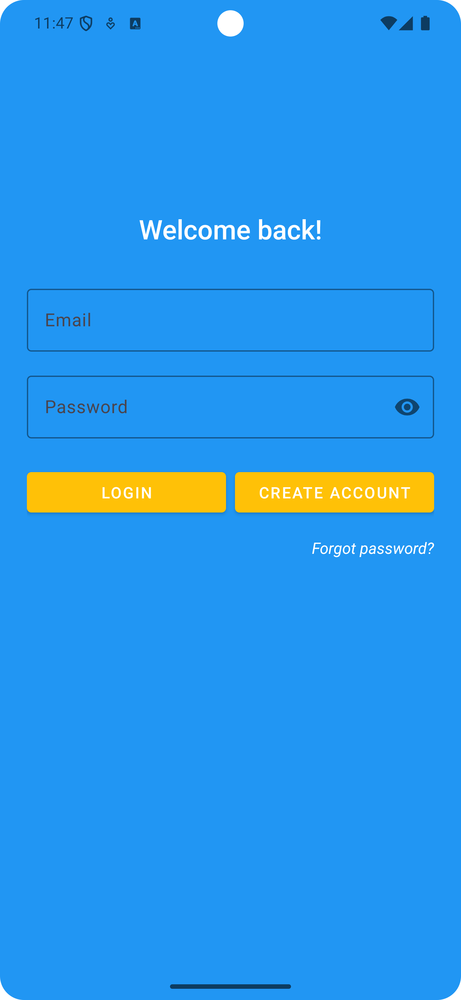
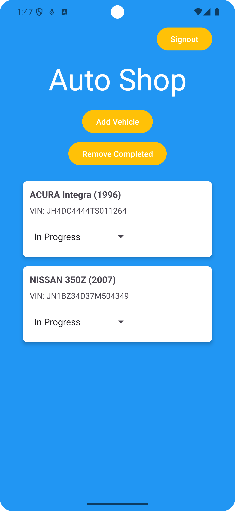
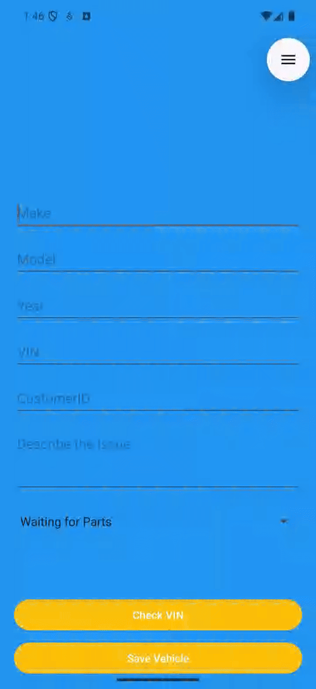
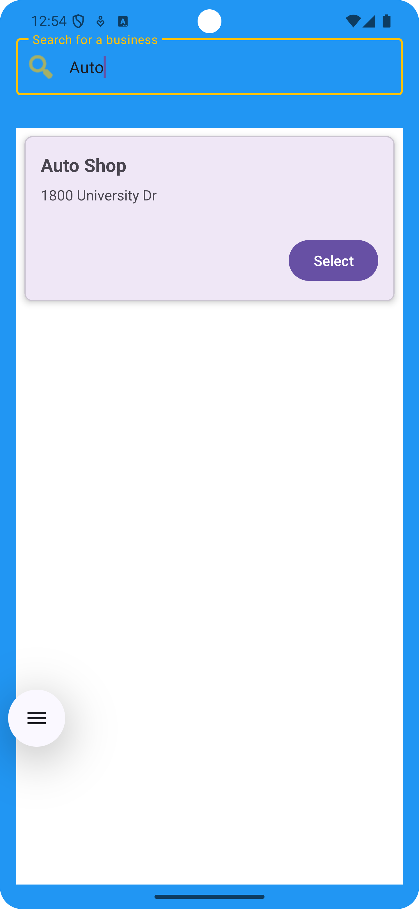

# AutoSync

AutoSync is an Android application that bridges the gap between **auto repair shops** and **their customers**.  
It allows businesses to manage ongoing car repairs while giving customers visibility and convenience in finding trusted mechanics.

AutoSync provides two types of user accounts:
- **Customer Accounts:** Search for nearby mechanic shops and view their available services.
- **Business Accounts:** Add, update, and track vehicles currently being worked on.  

## Overview

When a business adds a new car to their list, they can **enter the VIN**, and the app automatically fetches the vehicle details from the [NHTSA Vehicle API](https://vpic.nhtsa.dot.gov/api/).  
Each car is displayed in a **RecyclerView** using **CardViews**, and the mechanic can track repair progress using a **status spinner** with three options:
- Waiting for Parts
- In Progress
- Completed  
---

## Tech Stack

**Language:** Kotlin  
**Framework:** Android SDK (minSdk 26, targetSdk 35)  
**Architecture:** MVVM  
**Libraries & Tools:**
- **Retrofit + Moshi** — REST API calls and JSON parsing
- **Firebase Auth, Firestore** — user authentication and data storage
- **Coroutines** — asynchronous operations
- **Material Components** — modern UI design
- **Navigation Component** — fragment navigation
- **ViewBinding** — type-safe view access  

---

## Screenshots

### Login Screen

### Business Dashboard

### Add Vehicle GIF

### Customer Dashboard

### Search Business Screen

## 🌐 API Integration
The app integrates with the [NHTSA Vehicle API](https://vpic.nhtsa.dot.gov/api/) to automatically populate car details using the VIN.
